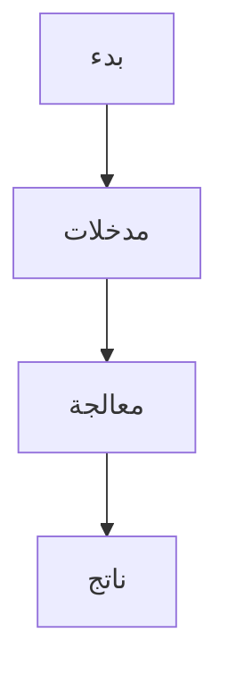
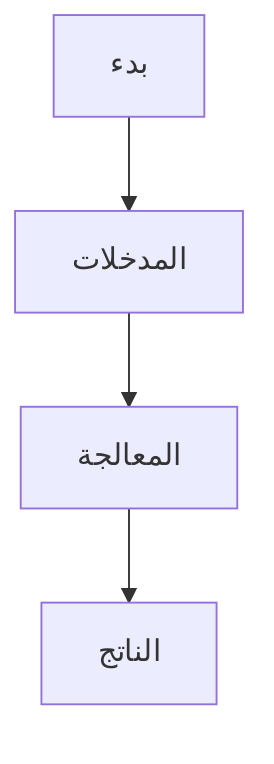

```mermaid
flowchart TD
  A-->B
```

```mermaid
flowchart TD
  A["بدء"] --> B["مدخلات"]
  B --> C["معالجة"]
  C --> D["ناتج"]
```

```mermaid
%%{init: {'theme': 'base',
          'fontFamily': "'Amiri','Noto Naskh Arabic','Segoe UI','Arial'",
          'themeCSS': '.nodeLabel, .label { direction: rtl; unicode-bidi: isolate-override; text-align: right; }'}}%%
flowchart TD
  A["بدء"] --> B["المدخلات"] --> C["المعالجة"] --> D["الناتج"]
```
